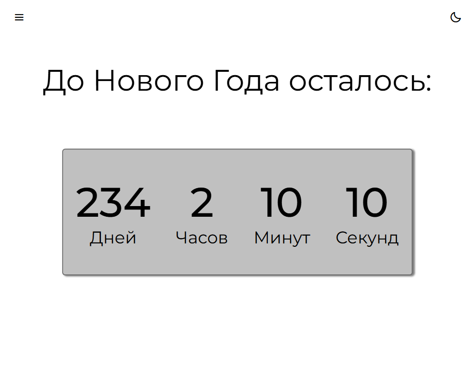
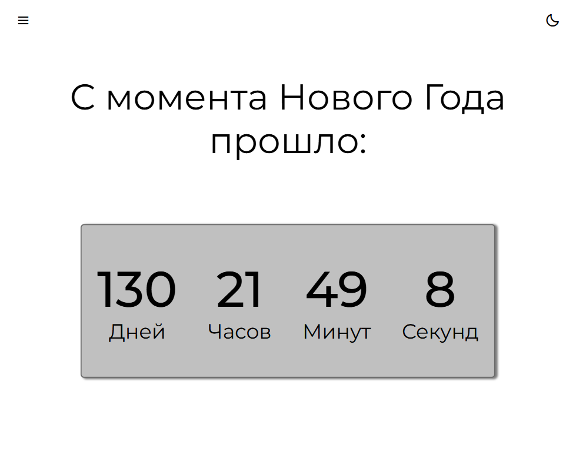

# New Year Tracker

### [EN]

An interactive web application with a minimalist and intuitive design.
The application uses two timers to track the time remaining until New Year's and the time elapsed since New Year's.

### Stack:

* HTML5 (BEM)
* CSS3
* JavaScript (Vanilla)

The project is implemented in pure JavaScript using Multi-Page Architecture (MPA).

[Main link](https://r3nfix.github.io/new-year-tracker/)  
[Alternative link netlify](https://new-year-tracker.netlify.app) (may not work without VPN in Russia)

### [RU]

Интерактивное веб-приложение с минималистичным и понятным дизайном.  
Приложение позволяет в режиме двух таймеров отслеживать время, оставшееся до Нового года и время, пройденное после Нового года.

### Стек:

* HTML5 (BEM)
* CSS3
* JavaScript (Vanilla)

Проект реализован на чистом JavaScript с использованием многостраничной архитектуры (MPA).

[Основная ссылка](https://r3nfix.github.io/new-year-tracker/)  
[Альтернативная ссылка netlify](https://new-year-tracker.netlify.app) (может не работать без VPN в России)
